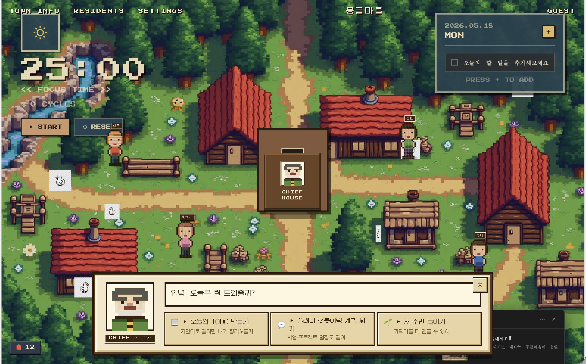

# 몽글마을

스타듀밸리 스타일의 픽셀아트 마을에서 AI와 함께 할 일을 관리하는 프로젝트입니다.



---

## 필요 조건

| 도구 | 버전 | 설치 방법 |
|------|------|-----------|
| Python | 3.11 이상 | [python.org](https://www.python.org/downloads/) |
| uv | 최신 | `curl -LsSf https://astral.sh/uv/install.sh \| sh` |
| OpenAI API Key | — | [platform.openai.com](https://platform.openai.com/api-keys) |

---

## 설치

```bash
# 1. 저장소 클론
git clone <repo-url>
cd mongle-village

# 2. 의존성 설치 (UI 포함)
uv sync --extra ui
```

---

## 환경변수 설정

```bash
cp .env.example .env
```

`.env` 파일을 열고 값을 채워주세요:

```env
# 필수
OPENAI_API_KEY=sk-...

# 선택 (기본값: local)
# STORAGE_BACKEND=local   # 이미지를 로컬에 저장
# STORAGE_BACKEND=s3      # AWS S3에 저장 (아래 AWS 설정 필요)

# S3 사용 시에만 필요
# AWS_REGION=ap-northeast-2
# AWS_S3_BUCKET=my-bucket
```

> **로컬 모드**가 기본값입니다. `OPENAI_API_KEY`만 설정하면 바로 실행됩니다.
> 생성된 이미지는 `data/local_storage/`에 저장됩니다.

---

## 실행

```bash
uv run streamlit run streamlit_app/app.py
```

브라우저에서 http://localhost:8501 을 열면 됩니다.

---

## 주요 기능

- **마을 지도**: 픽셀아트 스타일의 전체화면 마을 배경
- **새 주민 맞이하기**: 사진과 성격 키워드를 입력하면 AI가 캐릭터를 생성
- **오늘의 TODO**: 할 일을 자유롭게 입력하면 AI가 항목별로 정리
- **장기 플랜**: 이장님과 대화하며 일자별 계획 수립

---

## 픽셀아트 타일셋 적용 (선택)

더 풍부한 비주얼을 원한다면 Kenney의 무료 타일셋을 적용할 수 있습니다.

1. [kenney.nl/assets/tiny-town](https://kenney.nl/assets/tiny-town) 에서 무료 다운로드
2. ZIP 압축 해제 후 스프라이트시트를 프로젝트에 복사:
   ```
   streamlit_app/static/tileset.png
   ```
3. 앱을 재시작하면 자동으로 적용됩니다.

---

## 프로젝트 구조

```
mongle-village/
├── streamlit_app/            # UI (Streamlit)
│   └── app.py                # 메인 앱 진입점
├── agents/                   # AI 에이전트 파이프라인
│   ├── character_creation/   # 캐릭터 생성
│   └── todo_creation/        # TODO 생성
├── adapters/                 # 외부 서비스 연결 (OpenAI, S3 등)
├── data/local_storage/       # 로컬 저장소 (이미지 등)
├── docs/                     # 설계 문서
└── tests/                    # 테스트
```

---

## 테스트 실행

```bash
uv run pytest
```

외부 API를 호출하는 contract 테스트는 기본적으로 제외됩니다.
API 키가 있을 때 실행하려면:

```bash
uv run pytest -m contract
```
