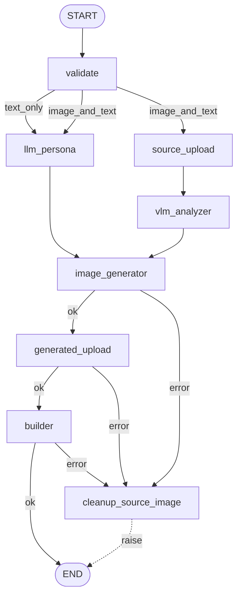

# character_creation LangGraph 마이그레이션 — 구현 계획

> **For agentic workers:** REQUIRED SUB-SKILL: Use superpowers:subagent-driven-development (recommended) or superpowers:executing-plans to implement this plan task-by-task. Steps use checkbox (`- [ ]`) syntax for tracking.

**Goal:** `agents/character_creation/` 파이프라인을 LangGraph `StateGraph` 기반 풀-네이티브 구현으로 재작성. 호출자 호환성, 외부 동작, 테스트 통과율, 80%+ 커버리지를 모두 유지한다.

**Architecture:** `pipeline.py` 의 명령형 오케스트레이션을 선언적 `StateGraph` 로 교체. 노드 내부 재시도 루프는 LangGraph `RetryPolicy` 로 이관(단, `vlm_analyzer` 는 그래프 진행을 위해 내부 try/except 유지). 실패 시 source 이미지 삭제는 `cleanup_source_image` compensation 노드로 표현. Port DI 패턴은 `RunnableConfig.configurable["ports"]` 로 유지.

**Tech Stack:** Python 3.11+, Pydantic 2, pytest 8, pytest-asyncio, pytest-cov, **LangGraph 0.2.x (신규)**.

**Spec:** `docs/superpowers/specs/2026-05-22-character-creation-langgraph-design.md`

**Repo 상태:** 본 프로젝트는 git 저장소가 아니다 (`git status` → fatal). 각 Task 의 "Commit" 스텝은 git 이 초기화되어 있을 때만 수행하고, 아닌 경우 스킵 표시 후 다음 Task 로 진행한다.

---

## 사전 조건

- 작업 디렉토리: `/Users/jpaper/Documents/projects/mongle-village`
- Python 가상환경 활성화, `pip install -e .[dev]` 가능 상태
- 기존 테스트 베이스라인 확인: `pytest -q` 그린이어야 시작.

각 Task 시작 전 베이스라인 그린 확인:

```bash
pytest tests/agents/character_creation -q
```

기대: 모든 테스트 PASS, coverage ≥ 80%.

---

## Task 1: langgraph 의존성 추가

**Files:**
- Modify: `pyproject.toml`

- [ ] **Step 1: pyproject.toml 의존성 섹션 수정**

`pyproject.toml` 의 `[project]` 의 `dependencies` 리스트에 `langgraph` 추가:

```toml
dependencies = [
    "pydantic>=2.6,<3",
    "boto3>=1.34",
    "langgraph>=0.2,<0.3",
]
```

- [ ] **Step 2: 설치 검증**

```bash
pip install -e .[dev]
python -c "import langgraph; from langgraph.graph import StateGraph, START, END; print(langgraph.__version__)"
```

기대: `0.2.x` 출력, 오류 없음.

- [ ] **Step 3: 기존 테스트 베이스라인 재확인**

```bash
pytest tests/agents/character_creation -q
```

기대: 모든 테스트 PASS (langgraph 설치만으로 회귀 없어야 함).

- [ ] **Step 4: Commit (git 초기화된 경우만)**

```bash
git add pyproject.toml
git commit -m "chore: add langgraph dependency"
```

---

## Task 2: CharacterGraphState 생성

**Files:**
- Create: `agents/character_creation/state.py`
- Create: `tests/agents/character_creation/test_state.py`

- [ ] **Step 1: 실패하는 테스트 작성**

`tests/agents/character_creation/test_state.py`:

```python
from __future__ import annotations

from agents.character_creation.schemas import CharacterCreationInput
from agents.character_creation.state import CharacterGraphState


def _input() -> CharacterCreationInput:
    return CharacterCreationInput(user_id="u1", name="몽글이", persona="다정한 곰")


def test_state_initial_fields_default_to_none() -> None:
    state = CharacterGraphState(input=_input(), is_regeneration=False)
    assert state.route is None
    assert state.llm_result is None
    assert state.vlm_result is None
    assert state.source_url is None
    assert state.source_key is None
    assert state.image_bytes is None
    assert state.generated_url is None
    assert state.entity is None
    assert state.error is None


def test_state_partial_update_via_model_copy() -> None:
    state = CharacterGraphState(input=_input(), is_regeneration=False)
    updated = state.model_copy(update={"route": "text_only"})
    assert state.route is None
    assert updated.route == "text_only"
```

- [ ] **Step 2: 테스트 실패 확인**

```bash
pytest tests/agents/character_creation/test_state.py -v
```

기대: `ModuleNotFoundError: agents.character_creation.state`.

- [ ] **Step 3: state.py 구현**

`agents/character_creation/state.py`:

```python
from __future__ import annotations

from typing import Literal

from pydantic import BaseModel, ConfigDict

from agents.character_creation.schemas import (
    CharacterCreationInput,
    CharacterEntity,
    LLMPersonaResult,
    VLMResult,
)

Route = Literal["text_only", "image_and_text"]


class CharacterGraphState(BaseModel):
    model_config = ConfigDict(arbitrary_types_allowed=True)

    input: CharacterCreationInput
    is_regeneration: bool

    route: Route | None = None

    llm_result: LLMPersonaResult | None = None
    vlm_result: VLMResult | None = None

    source_url: str | None = None
    source_key: str | None = None

    image_bytes: bytes | None = None
    generated_url: str | None = None

    entity: CharacterEntity | None = None

    error: Exception | None = None
```

- [ ] **Step 4: 테스트 통과 확인**

```bash
pytest tests/agents/character_creation/test_state.py -v
```

기대: 2 PASS.

- [ ] **Step 5: Commit**

```bash
git add agents/character_creation/state.py tests/agents/character_creation/test_state.py
git commit -m "feat(character_creation): add CharacterGraphState"
```

---

## Task 3: router.decide() 시그니처 전환

**Files:**
- Modify: `agents/character_creation/router.py`
- Modify: `tests/agents/character_creation/test_router.py`

기존 `decide(input) -> RouteDecision` 을 `decide(state) -> list[str]` 로 교체한다. `RouteDecision` Enum 은 제거 (`pipeline.py` 가 유일한 import 처였으며 Task 12 에서 함께 정리).

- [ ] **Step 1: 테스트 재작성**

`tests/agents/character_creation/test_router.py` 전체 교체:

```python
from __future__ import annotations

from agents.character_creation.router import decide
from agents.character_creation.schemas import CharacterCreationInput, SourceImage
from agents.character_creation.state import CharacterGraphState


def _state(*, with_image: bool) -> CharacterGraphState:
    src = (
        SourceImage(filename="a.png", content_type="image/png", data=b"\x89PNG")
        if with_image
        else None
    )
    return CharacterGraphState(
        input=CharacterCreationInput(
            user_id="u1", name="몽글이", persona="다정한 곰", source_image=src
        ),
        is_regeneration=False,
    )


def test_decide_text_only_when_no_image() -> None:
    assert decide(_state(with_image=False)) == ["llm_persona"]


def test_decide_image_and_text_when_image_present() -> None:
    assert decide(_state(with_image=True)) == ["llm_persona", "source_upload"]
```

- [ ] **Step 2: 테스트 실패 확인**

```bash
pytest tests/agents/character_creation/test_router.py -v
```

기대: ImportError 또는 AssertionError.

- [ ] **Step 3: router.py 재작성**

`agents/character_creation/router.py` 전체 교체:

```python
from __future__ import annotations

from agents.character_creation.state import CharacterGraphState


def decide(state: CharacterGraphState) -> list[str]:
    if state.input.source_image is not None:
        return ["llm_persona", "source_upload"]
    return ["llm_persona"]
```

- [ ] **Step 4: 테스트 통과 확인**

```bash
pytest tests/agents/character_creation/test_router.py -v
```

기대: 2 PASS.

- [ ] **Step 5: Commit**

```bash
git add agents/character_creation/router.py tests/agents/character_creation/test_router.py
git commit -m "refactor(character_creation): router.decide takes state, returns next nodes"
```

---

## Task 4: validate 노드 생성

**Files:**
- Create: `agents/character_creation/nodes/validate.py`
- Create: `tests/agents/character_creation/test_node_validate.py`

- [ ] **Step 1: 실패 테스트 작성**

`tests/agents/character_creation/test_node_validate.py`:

```python
from __future__ import annotations

import pytest

from agents.character_creation.exceptions import ValidationFailedError
from agents.character_creation.nodes.validate import validate_node
from agents.character_creation.schemas import CharacterCreationInput, SourceImage
from agents.character_creation.state import CharacterGraphState
from tests.agents.character_creation.fakes import FakeRepository


def _state(*, with_image: bool, is_regen: bool = False) -> CharacterGraphState:
    src = (
        SourceImage(filename="a.png", content_type="image/png", data=b"\x89PNG")
        if with_image
        else None
    )
    return CharacterGraphState(
        input=CharacterCreationInput(
            user_id="u1", name="몽글이", persona="다정한 곰", source_image=src
        ),
        is_regeneration=is_regen,
    )


def _config(repo: FakeRepository) -> dict:
    class _Ports:
        repository = repo
    return {"configurable": {"ports": _Ports()}}


async def test_validate_node_text_only_sets_route() -> None:
    out = await validate_node(_state(with_image=False), _config(FakeRepository()))
    assert out == {"route": "text_only"}


async def test_validate_node_image_present_sets_route() -> None:
    out = await validate_node(_state(with_image=True), _config(FakeRepository()))
    assert out == {"route": "image_and_text"}


async def test_validate_node_propagates_validation_error() -> None:
    with pytest.raises(ValidationFailedError):
        await validate_node(
            _state(with_image=False),
            _config(FakeRepository(active_count=10)),
        )
```

- [ ] **Step 2: 테스트 실패 확인**

```bash
pytest tests/agents/character_creation/test_node_validate.py -v
```

기대: ImportError.

- [ ] **Step 3: validate_node 구현**

`agents/character_creation/nodes/validate.py`:

```python
from __future__ import annotations

from typing import Any

from agents.character_creation import validation
from agents.character_creation.state import CharacterGraphState


async def validate_node(state: CharacterGraphState, config: dict[str, Any]) -> dict[str, Any]:
    ports = config["configurable"]["ports"]
    await validation.check(
        state.input, repo=ports.repository, is_regeneration=state.is_regeneration
    )
    route = "image_and_text" if state.input.source_image is not None else "text_only"
    return {"route": route}
```

- [ ] **Step 4: 테스트 통과 확인**

```bash
pytest tests/agents/character_creation/test_node_validate.py -v
```

기대: 3 PASS.

- [ ] **Step 5: Commit**

```bash
git add agents/character_creation/nodes/validate.py tests/agents/character_creation/test_node_validate.py
git commit -m "feat(character_creation): add validate_node"
```

---

## Task 5: llm_persona 노드 (retry 제거, 1회 호출)

**Files:**
- Modify: `agents/character_creation/nodes/llm_persona.py`
- Modify: `tests/agents/character_creation/test_llm_persona.py`

retry 루프는 그래프 레벨 `RetryPolicy` 가 담당. 노드는 1회 호출만 수행한다.

- [ ] **Step 1: 단위 테스트 재작성**

`tests/agents/character_creation/test_llm_persona.py` 전체 교체:

```python
from __future__ import annotations

import pytest

from agents.character_creation.exceptions import LLMFailedError
from agents.character_creation.nodes.llm_persona import llm_persona_node
from agents.character_creation.schemas import CharacterCreationInput
from agents.character_creation.state import CharacterGraphState
from tests.agents.character_creation.fakes import FakeLLM


def _state() -> CharacterGraphState:
    return CharacterGraphState(
        input=CharacterCreationInput(user_id="u1", name="몽글이", persona="다정한 곰"),
        is_regeneration=False,
    )


def _config(llm: FakeLLM) -> dict:
    class _Ports:
        pass
    p = _Ports()
    p.llm = llm
    return {"configurable": {"ports": p}}


async def test_llm_persona_node_returns_result_dict() -> None:
    llm = FakeLLM()
    out = await llm_persona_node(_state(), _config(llm))
    assert out["llm_result"].personality.startswith("성격:")
    assert llm.calls == 1


async def test_llm_persona_node_propagates_failure_for_retry_policy() -> None:
    llm = FakeLLM(fail_times=1)
    with pytest.raises(LLMFailedError):
        await llm_persona_node(_state(), _config(llm))
    assert llm.calls == 1
```

- [ ] **Step 2: 테스트 실패 확인**

```bash
pytest tests/agents/character_creation/test_llm_persona.py -v
```

기대: 시그니처 불일치로 인한 실패.

- [ ] **Step 3: 구현 교체**

`agents/character_creation/nodes/llm_persona.py` 전체 교체:

```python
from __future__ import annotations

from typing import Any

from agents.character_creation.state import CharacterGraphState


async def llm_persona_node(state: CharacterGraphState, config: dict[str, Any]) -> dict[str, Any]:
    ports = config["configurable"]["ports"]
    result = await ports.llm.generate_persona(
        persona=state.input.persona,
        keywords=state.input.personality_keywords,
    )
    return {"llm_result": result}
```

- [ ] **Step 4: 테스트 통과 확인**

```bash
pytest tests/agents/character_creation/test_llm_persona.py -v
```

기대: 2 PASS.

- [ ] **Step 5: Commit**

```bash
git add agents/character_creation/nodes/llm_persona.py tests/agents/character_creation/test_llm_persona.py
git commit -m "refactor(character_creation): llm_persona node is a single call; retry moves to graph"
```

---

## Task 6: vlm_analyzer 노드 (내부 retry+폴백 유지)

**Files:**
- Modify: `agents/character_creation/nodes/vlm_analyzer.py`
- Modify: `tests/agents/character_creation/test_vlm_analyzer.py`

VLM 실패는 그래프가 중단되지 않고 `vlm_result=None` 으로 진행해야 한다. RetryPolicy 만으로는 표현 불가하므로 노드 내부에서 try/except 3회 + 폴백.

- [ ] **Step 1: 테스트 재작성**

`tests/agents/character_creation/test_vlm_analyzer.py` 전체 교체:

```python
from __future__ import annotations

from agents.character_creation.nodes.vlm_analyzer import vlm_analyzer_node
from agents.character_creation.schemas import CharacterCreationInput, SourceImage
from agents.character_creation.state import CharacterGraphState
from tests.agents.character_creation.fakes import FakeVLM


def _state() -> CharacterGraphState:
    return CharacterGraphState(
        input=CharacterCreationInput(
            user_id="u1",
            name="몽글이",
            persona="다정한 곰",
            source_image=SourceImage(filename="a.png", content_type="image/png", data=b"\x89PNG"),
        ),
        is_regeneration=False,
    )


def _config(vlm: FakeVLM) -> dict:
    class _Ports:
        pass
    p = _Ports()
    p.vlm = vlm
    return {"configurable": {"ports": p}}


async def test_vlm_analyzer_returns_result_on_success() -> None:
    vlm = FakeVLM()
    out = await vlm_analyzer_node(_state(), _config(vlm))
    assert out["vlm_result"] is not None
    assert vlm.calls == 1


async def test_vlm_analyzer_returns_none_after_three_failures() -> None:
    vlm = FakeVLM(fail_times=3)
    out = await vlm_analyzer_node(_state(), _config(vlm))
    assert out["vlm_result"] is None
    assert vlm.calls == 3


async def test_vlm_analyzer_succeeds_on_second_attempt() -> None:
    vlm = FakeVLM(fail_times=1)
    out = await vlm_analyzer_node(_state(), _config(vlm))
    assert out["vlm_result"] is not None
    assert vlm.calls == 2
```

- [ ] **Step 2: 테스트 실패 확인**

```bash
pytest tests/agents/character_creation/test_vlm_analyzer.py -v
```

기대: ImportError 또는 시그니처 불일치.

- [ ] **Step 3: 구현 교체**

`agents/character_creation/nodes/vlm_analyzer.py` 전체 교체:

```python
from __future__ import annotations

from typing import Any

from agents.character_creation.exceptions import VLMFailedError
from agents.character_creation.state import CharacterGraphState

MAX_ATTEMPTS = 3


async def vlm_analyzer_node(state: CharacterGraphState, config: dict[str, Any]) -> dict[str, Any]:
    ports = config["configurable"]["ports"]
    assert state.input.source_image is not None
    for _ in range(MAX_ATTEMPTS):
        try:
            result = await ports.vlm.extract_appearance(state.input.source_image)
            return {"vlm_result": result}
        except VLMFailedError:
            continue
    return {"vlm_result": None}
```

- [ ] **Step 4: 테스트 통과 확인**

```bash
pytest tests/agents/character_creation/test_vlm_analyzer.py -v
```

기대: 3 PASS.

- [ ] **Step 5: Commit**

```bash
git add agents/character_creation/nodes/vlm_analyzer.py tests/agents/character_creation/test_vlm_analyzer.py
git commit -m "refactor(character_creation): vlm_analyzer node uses internal retry+None fallback"
```

---

## Task 7: image_upload helper + source_upload/generated_upload 분리

**Files:**
- Modify: `agents/character_creation/nodes/image_upload.py`
- Create: `agents/character_creation/nodes/source_upload.py`
- Create: `agents/character_creation/nodes/generated_upload.py`
- Modify: `tests/agents/character_creation/test_image_upload.py`
- Create: `tests/agents/character_creation/test_node_source_upload.py`
- Create: `tests/agents/character_creation/test_node_generated_upload.py`

`image_upload.py` 는 `key_for` + `put_once` 헬퍼만 남기고, 두 노드는 각각 source / generated 업로드를 1회 호출한다. retry 는 RetryPolicy.

- [ ] **Step 1: 기존 image_upload 테스트 재작성 (helper 만 검증)**

`tests/agents/character_creation/test_image_upload.py` 전체 교체:

```python
from __future__ import annotations

import pytest

from agents.character_creation.exceptions import S3UploadFailedError
from agents.character_creation.nodes.image_upload import key_for, put_once
from tests.agents.character_creation.fakes import FakeS3


def test_key_for_appends_correct_extension() -> None:
    key = key_for("u1", "image/png", prefix="sources")
    assert key.startswith("sources/u1/")
    assert key.endswith(".png")


def test_key_for_jpeg_maps_to_jpg() -> None:
    assert key_for("u1", "image/jpeg", prefix="sources").endswith(".jpg")


async def test_put_once_returns_url() -> None:
    s3 = FakeS3()
    url = await put_once(s3, key="sources/u1/abc.png", body=b"x", content_type="image/png")
    assert url.startswith("https://fake-s3.local/")


async def test_put_once_raises_on_failure_without_retry() -> None:
    s3 = FakeS3(fail_times=1)
    with pytest.raises(S3UploadFailedError):
        await put_once(s3, key="sources/u1/abc.png", body=b"x", content_type="image/png")
    assert s3.calls == 1
```

- [ ] **Step 2: source_upload 노드 테스트 작성**

`tests/agents/character_creation/test_node_source_upload.py`:

```python
from __future__ import annotations

import pytest

from agents.character_creation.exceptions import S3UploadFailedError
from agents.character_creation.nodes.source_upload import source_upload_node
from agents.character_creation.schemas import CharacterCreationInput, SourceImage
from agents.character_creation.state import CharacterGraphState
from tests.agents.character_creation.fakes import FakeS3


def _state() -> CharacterGraphState:
    return CharacterGraphState(
        input=CharacterCreationInput(
            user_id="u1",
            name="몽글이",
            persona="다정한 곰",
            source_image=SourceImage(filename="a.png", content_type="image/png", data=b"\x89PNG"),
        ),
        is_regeneration=False,
    )


def _config(s3: FakeS3) -> dict:
    class _Ports:
        pass
    p = _Ports()
    p.s3 = s3
    return {"configurable": {"ports": p}}


async def test_source_upload_returns_url_and_key() -> None:
    s3 = FakeS3()
    out = await source_upload_node(_state(), _config(s3))
    assert out["source_url"].startswith("https://fake-s3.local/sources/u1/")
    assert out["source_key"].startswith("sources/u1/")
    assert s3.calls == 1


async def test_source_upload_raises_for_retry_policy() -> None:
    s3 = FakeS3(fail_times=1)
    with pytest.raises(S3UploadFailedError):
        await source_upload_node(_state(), _config(s3))
    assert s3.calls == 1
```

- [ ] **Step 3: generated_upload 노드 테스트 작성**

`tests/agents/character_creation/test_node_generated_upload.py`:

```python
from __future__ import annotations

import pytest

from agents.character_creation.exceptions import S3UploadFailedError
from agents.character_creation.nodes.generated_upload import generated_upload_node
from agents.character_creation.schemas import CharacterCreationInput
from agents.character_creation.state import CharacterGraphState
from tests.agents.character_creation.fakes import FakeS3


def _state() -> CharacterGraphState:
    return CharacterGraphState(
        input=CharacterCreationInput(user_id="u1", name="몽글이", persona="다정한 곰"),
        is_regeneration=False,
        image_bytes=b"GENERATED_PNG_BYTES",
    )


def _config(s3: FakeS3) -> dict:
    class _Ports:
        pass
    p = _Ports()
    p.s3 = s3
    return {"configurable": {"ports": p}}


async def test_generated_upload_returns_url() -> None:
    s3 = FakeS3()
    out = await generated_upload_node(_state(), _config(s3))
    assert out["generated_url"].startswith("https://fake-s3.local/characters/u1/")
    assert s3.calls == 1


async def test_generated_upload_raises_for_retry_policy() -> None:
    s3 = FakeS3(fail_times=1)
    with pytest.raises(S3UploadFailedError):
        await generated_upload_node(_state(), _config(s3))
```

- [ ] **Step 4: 세 테스트 모두 실패 확인**

```bash
pytest tests/agents/character_creation/test_image_upload.py tests/agents/character_creation/test_node_source_upload.py tests/agents/character_creation/test_node_generated_upload.py -v
```

기대: ImportError / AttributeError.

- [ ] **Step 5: image_upload.py helper 단순화**

`agents/character_creation/nodes/image_upload.py` 전체 교체:

```python
from __future__ import annotations

from uuid import uuid4

from agents.character_creation.protocols import S3Port

_EXT_BY_MIME = {
    "image/png": "png",
    "image/jpeg": "jpg",
    "image/jpg": "jpg",
}


def key_for(user_id: str, content_type: str, *, prefix: str) -> str:
    ext = _EXT_BY_MIME.get(content_type, "bin")
    return f"{prefix}/{user_id}/{uuid4()}.{ext}"


async def put_once(
    s3: S3Port, *, key: str, body: bytes, content_type: str
) -> str:
    return await s3.put_object(key=key, body=body, content_type=content_type)
```

- [ ] **Step 6: source_upload 노드 구현**

`agents/character_creation/nodes/source_upload.py`:

```python
from __future__ import annotations

from typing import Any

from agents.character_creation.nodes.image_upload import key_for, put_once
from agents.character_creation.state import CharacterGraphState


async def source_upload_node(
    state: CharacterGraphState, config: dict[str, Any]
) -> dict[str, Any]:
    ports = config["configurable"]["ports"]
    image = state.input.source_image
    assert image is not None
    key = key_for(state.input.user_id, image.content_type, prefix="sources")
    url = await put_once(
        ports.s3, key=key, body=image.data, content_type=image.content_type
    )
    return {"source_url": url, "source_key": key}
```

- [ ] **Step 7: generated_upload 노드 구현**

`agents/character_creation/nodes/generated_upload.py`:

```python
from __future__ import annotations

from typing import Any

from agents.character_creation.nodes.image_upload import key_for, put_once
from agents.character_creation.state import CharacterGraphState


async def generated_upload_node(
    state: CharacterGraphState, config: dict[str, Any]
) -> dict[str, Any]:
    ports = config["configurable"]["ports"]
    assert state.image_bytes is not None
    key = key_for(state.input.user_id, "image/png", prefix="characters")
    url = await put_once(
        ports.s3, key=key, body=state.image_bytes, content_type="image/png"
    )
    return {"generated_url": url}
```

- [ ] **Step 8: 세 테스트 모두 통과 확인**

```bash
pytest tests/agents/character_creation/test_image_upload.py tests/agents/character_creation/test_node_source_upload.py tests/agents/character_creation/test_node_generated_upload.py -v
```

기대: 모두 PASS.

- [ ] **Step 9: Commit**

```bash
git add agents/character_creation/nodes/image_upload.py \
        agents/character_creation/nodes/source_upload.py \
        agents/character_creation/nodes/generated_upload.py \
        tests/agents/character_creation/test_image_upload.py \
        tests/agents/character_creation/test_node_source_upload.py \
        tests/agents/character_creation/test_node_generated_upload.py
git commit -m "refactor(character_creation): split image_upload into helper + two nodes"
```

---

## Task 8: image_generator 노드 (retry 제거, error 캡처)

**Files:**
- Modify: `agents/character_creation/nodes/image_generator.py`
- Modify: `tests/agents/character_creation/test_image_generator.py`

이 노드는 compensation 분기를 트리거하는 첫 번째 지점이므로, 예외를 raise 하지 않고 `state.error` 에 기록한 dict 를 반환한다. RetryPolicy 가 먼저 동작하여 max_attempts 소진 후의 예외만 여기까지 도달.

- [ ] **Step 1: 단위 테스트 재작성**

`tests/agents/character_creation/test_image_generator.py` 전체 교체:

```python
from __future__ import annotations

from agents.character_creation.exceptions import ImageGenerationFailedError
from agents.character_creation.nodes.image_generator import image_generator_node
from agents.character_creation.schemas import (
    CharacterCreationInput,
    LLMPersonaResult,
    VLMResult,
)
from agents.character_creation.state import CharacterGraphState
from tests.agents.character_creation.fakes import FakeCounter, FakeImageGenerator


def _state(*, with_vlm: bool = False) -> CharacterGraphState:
    return CharacterGraphState(
        input=CharacterCreationInput(user_id="u1", name="몽글이", persona="다정한 곰"),
        is_regeneration=False,
        llm_result=LLMPersonaResult(personality="p", speech_style="s", background="b"),
        vlm_result=VLMResult(appearance_description="둥근 갈색 곰") if with_vlm else None,
    )


def _config(img: FakeImageGenerator, counter: FakeCounter) -> dict:
    class _Ports:
        pass
    p = _Ports()
    p.image_generator = img
    p.counter = counter
    return {"configurable": {"ports": p}}


async def test_image_generator_returns_bytes_on_success() -> None:
    img = FakeImageGenerator()
    out = await image_generator_node(_state(), _config(img, FakeCounter()))
    assert out["image_bytes"] == b"GENERATED_PNG_BYTES"
    assert img.calls == 1
    assert out.get("error") is None


async def test_image_generator_records_error_on_failure() -> None:
    img = FakeImageGenerator(fail_times=1)
    out = await image_generator_node(_state(), _config(img, FakeCounter()))
    assert out.get("image_bytes") is None
    assert isinstance(out["error"], ImageGenerationFailedError)


async def test_image_generator_passes_vlm_result_when_present() -> None:
    img = FakeImageGenerator()
    await image_generator_node(_state(with_vlm=True), _config(img, FakeCounter()))
    assert img.last_inputs["vlm_result"] is not None
    assert img.last_inputs["fallback_persona"] is None


async def test_image_generator_sets_fallback_persona_when_no_vlm() -> None:
    img = FakeImageGenerator()
    await image_generator_node(_state(with_vlm=False), _config(img, FakeCounter()))
    assert img.last_inputs["vlm_result"] is None
    assert img.last_inputs["fallback_persona"] == "다정한 곰"


async def test_image_generator_increments_counter() -> None:
    counter = FakeCounter()
    await image_generator_node(_state(), _config(FakeImageGenerator(), counter))
    assert counter.today == 1
```

- [ ] **Step 2: 테스트 실패 확인**

```bash
pytest tests/agents/character_creation/test_image_generator.py -v
```

기대: ImportError 또는 시그니처 불일치.

- [ ] **Step 3: 구현 교체**

`agents/character_creation/nodes/image_generator.py` 전체 교체:

```python
from __future__ import annotations

from typing import Any

from agents.character_creation.exceptions import ImageGenerationFailedError
from agents.character_creation.state import CharacterGraphState


async def image_generator_node(
    state: CharacterGraphState, config: dict[str, Any]
) -> dict[str, Any]:
    ports = config["configurable"]["ports"]
    assert state.llm_result is not None

    await ports.counter.increment(state.input.user_id)
    try:
        image_bytes = await ports.image_generator.generate(
            user_id=state.input.user_id,
            llm_result=state.llm_result,
            vlm_result=state.vlm_result,
            fallback_persona=state.input.persona if state.vlm_result is None else None,
        )
    except ImageGenerationFailedError as err:
        return {"error": err}
    return {"image_bytes": image_bytes}
```

- [ ] **Step 4: 테스트 통과 확인**

```bash
pytest tests/agents/character_creation/test_image_generator.py -v
```

기대: 5 PASS.

- [ ] **Step 5: Commit**

```bash
git add agents/character_creation/nodes/image_generator.py tests/agents/character_creation/test_image_generator.py
git commit -m "refactor(character_creation): image_generator node captures error for compensation"
```

---

## Task 9: builder 노드 (state 래퍼, error 캡처)

**Files:**
- Modify: `agents/character_creation/nodes/builder.py`
- Modify: `tests/agents/character_creation/test_builder.py`

기존 `build()` 헬퍼 함수는 그대로 유지하여 기존 단위 테스트가 통과. 위에 `builder_node` 추가.

- [ ] **Step 1: 단위 테스트 보강**

`tests/agents/character_creation/test_builder.py` 의 기존 테스트는 유지하고, 노드 테스트를 같은 파일에 추가. 파일 상단 import 가 필요한 경우 보충:

```python
# 기존 import 들 아래에 추가
from agents.character_creation.nodes.builder import builder_node
from agents.character_creation.schemas import LLMPersonaResult
from agents.character_creation.state import CharacterGraphState


async def test_builder_node_assembles_entity() -> None:
    state = CharacterGraphState(
        input=CharacterCreationInput(user_id="u1", name="몽글이", persona="다정한 곰"),
        is_regeneration=False,
        llm_result=LLMPersonaResult(personality="p", speech_style="s", background="b"),
        generated_url="https://fake-s3.local/characters/u1/x.png",
    )
    out = await builder_node(state, {"configurable": {"ports": object(), "now": None}})
    entity = out["entity"]
    assert entity.name == "몽글이"
    assert entity.image_url.endswith("x.png")
    assert entity.source_image_url is None


async def test_builder_node_records_error_when_state_invalid() -> None:
    state = CharacterGraphState(
        input=CharacterCreationInput(user_id="u1", name="몽글이", persona="다정한 곰"),
        is_regeneration=False,
    )
    out = await builder_node(state, {"configurable": {"ports": object(), "now": None}})
    assert isinstance(out.get("error"), Exception)
```

기존 파일에 `CharacterCreationInput` import 가 이미 있는지 확인하고 없으면 추가.

- [ ] **Step 2: 테스트 실패 확인**

```bash
pytest tests/agents/character_creation/test_builder.py -v
```

기대: ImportError on `builder_node`.

- [ ] **Step 3: builder.py 에 노드 함수 추가**

`agents/character_creation/nodes/builder.py` 끝에 추가 (`build()` 함수는 그대로 유지). 파일 상단 import 에 `from datetime import datetime, timezone`, `from typing import Any` 가 없으면 보강:

```python
# 파일 끝에 추가
from typing import Any
from datetime import timezone  # 기존 datetime 옆에

from agents.character_creation.state import CharacterGraphState


async def builder_node(
    state: CharacterGraphState, config: dict[str, Any]
) -> dict[str, Any]:
    now = config["configurable"].get("now") or datetime.now(tz=timezone.utc)
    try:
        assert state.llm_result is not None
        assert state.generated_url is not None
        entity = build(
            input=state.input,
            llm_result=state.llm_result,
            vlm_result=state.vlm_result,
            generated_image_url=state.generated_url,
            source_image_url=state.source_url,
            now=now,
        )
    except Exception as err:
        return {"error": err}
    return {"entity": entity}
```

- [ ] **Step 4: 테스트 통과 확인**

```bash
pytest tests/agents/character_creation/test_builder.py -v
```

기대: 모두 PASS.

- [ ] **Step 5: Commit**

```bash
git add agents/character_creation/nodes/builder.py tests/agents/character_creation/test_builder.py
git commit -m "feat(character_creation): builder_node wraps build() with error capture"
```

---

## Task 10: cleanup_source_image 노드

**Files:**
- Create: `agents/character_creation/nodes/cleanup.py`
- Create: `tests/agents/character_creation/test_node_cleanup.py`

`state.error` 가 채워진 상태에서만 실행. `source_key` 가 있으면 삭제, 그 후 `state.error` 재발생.

- [ ] **Step 1: 실패 테스트 작성**

`tests/agents/character_creation/test_node_cleanup.py`:

```python
from __future__ import annotations

import pytest

from agents.character_creation.exceptions import ImageGenerationFailedError
from agents.character_creation.nodes.cleanup import cleanup_source_image_node
from agents.character_creation.schemas import CharacterCreationInput
from agents.character_creation.state import CharacterGraphState
from tests.agents.character_creation.fakes import FakeRepository


def _state(*, source_key: str | None, error: Exception) -> CharacterGraphState:
    return CharacterGraphState(
        input=CharacterCreationInput(user_id="u1", name="몽글이", persona="다정한 곰"),
        is_regeneration=False,
        source_key=source_key,
        error=error,
    )


def _config(repo: FakeRepository) -> dict:
    class _Ports:
        pass
    p = _Ports()
    p.repository = repo
    return {"configurable": {"ports": p}}


async def test_cleanup_deletes_source_key_then_raises() -> None:
    repo = FakeRepository()
    err = ImageGenerationFailedError("boom")
    with pytest.raises(ImageGenerationFailedError):
        await cleanup_source_image_node(
            _state(source_key="sources/u1/abc.png", error=err),
            _config(repo),
        )
    assert repo.deleted_keys == ["sources/u1/abc.png"]


async def test_cleanup_without_source_key_still_raises() -> None:
    repo = FakeRepository()
    err = ImageGenerationFailedError("boom")
    with pytest.raises(ImageGenerationFailedError):
        await cleanup_source_image_node(
            _state(source_key=None, error=err),
            _config(repo),
        )
    assert repo.deleted_keys == []
```

- [ ] **Step 2: 테스트 실패 확인**

```bash
pytest tests/agents/character_creation/test_node_cleanup.py -v
```

기대: ImportError.

- [ ] **Step 3: cleanup.py 구현**

`agents/character_creation/nodes/cleanup.py`:

```python
from __future__ import annotations

from typing import Any

from agents.character_creation.state import CharacterGraphState


async def cleanup_source_image_node(
    state: CharacterGraphState, config: dict[str, Any]
) -> dict[str, Any]:
    ports = config["configurable"]["ports"]
    if state.source_key:
        await ports.repository.delete_image_keys([state.source_key])
    assert state.error is not None
    raise state.error
```

- [ ] **Step 4: 테스트 통과 확인**

```bash
pytest tests/agents/character_creation/test_node_cleanup.py -v
```

기대: 2 PASS.

- [ ] **Step 5: Commit**

```bash
git add agents/character_creation/nodes/cleanup.py tests/agents/character_creation/test_node_cleanup.py
git commit -m "feat(character_creation): cleanup_source_image_node compensation node"
```

---

## Task 11: graph.py — StateGraph 조립

**Files:**
- Create: `agents/character_creation/graph.py`
- Create: `tests/agents/character_creation/test_graph.py`

LangGraph 0.2 API:
- `from langgraph.graph import StateGraph, START, END`
- `from langgraph.types import RetryPolicy` (버전에 따라 `langgraph.pregel.types` 일 수 있음 — Step 3 의 try/except 임포트로 처리)
- `add_node(name, fn, retry=RetryPolicy(max_attempts=..., retry_on=ExcClass))`
- `add_conditional_edges(source_node, path_fn)` — `path_fn(state)` 가 string 또는 list[string] 반환

- [ ] **Step 1: 그래프 동작 검증 테스트 작성**

`tests/agents/character_creation/test_graph.py`:

```python
from __future__ import annotations

import pytest

from agents.character_creation.exceptions import (
    ImageGenerationFailedError,
    LLMFailedError,
)
from agents.character_creation.graph import build_graph
from agents.character_creation.schemas import CharacterCreationInput, SourceImage
from agents.character_creation.state import CharacterGraphState
from tests.agents.character_creation.fakes import (
    FakeCounter,
    FakeImageGenerator,
    FakeLLM,
    FakeRepository,
    FakeS3,
    FakeVLM,
)


class _Ports:
    def __init__(self, **kw) -> None:
        self.llm = kw.get("llm") or FakeLLM()
        self.vlm = kw.get("vlm") or FakeVLM()
        self.s3 = kw.get("s3") or FakeS3()
        self.image_generator = kw.get("image_generator") or FakeImageGenerator()
        self.counter = kw.get("counter") or FakeCounter()
        self.repository = kw.get("repository") or FakeRepository()


def _state(*, with_image: bool = False) -> CharacterGraphState:
    src = (
        SourceImage(filename="a.png", content_type="image/png", data=b"\x89PNG")
        if with_image
        else None
    )
    return CharacterGraphState(
        input=CharacterCreationInput(
            user_id="u1", name="몽글이", persona="다정한 곰", source_image=src
        ),
        is_regeneration=False,
    )


def _final_entity(final):
    return final["entity"] if isinstance(final, dict) else final.entity


def _final_source_image_url(final):
    e = _final_entity(final)
    return e.source_image_url


async def test_graph_text_only_path_produces_entity() -> None:
    graph = build_graph()
    ports = _Ports()
    final = await graph.ainvoke(
        _state(),
        config={"configurable": {"ports": ports, "now": None}},
    )
    assert _final_entity(final) is not None
    assert ports.vlm.calls == 0


async def test_graph_image_path_invokes_vlm_and_source_upload() -> None:
    graph = build_graph()
    ports = _Ports()
    final = await graph.ainvoke(
        _state(with_image=True),
        config={"configurable": {"ports": ports, "now": None}},
    )
    assert _final_source_image_url(final) is not None
    assert ports.vlm.calls == 1


async def test_graph_llm_retry_policy_eventually_raises() -> None:
    graph = build_graph()
    ports = _Ports(llm=FakeLLM(fail_times=99))
    with pytest.raises(LLMFailedError):
        await graph.ainvoke(
            _state(), config={"configurable": {"ports": ports, "now": None}}
        )


async def test_graph_llm_retry_policy_succeeds_within_attempts() -> None:
    graph = build_graph()
    ports = _Ports(llm=FakeLLM(fail_times=2))
    final = await graph.ainvoke(
        _state(), config={"configurable": {"ports": ports, "now": None}}
    )
    assert _final_entity(final) is not None
    assert ports.llm.calls == 3


async def test_graph_image_generator_failure_triggers_source_cleanup() -> None:
    graph = build_graph()
    repo = FakeRepository()
    ports = _Ports(
        repository=repo,
        image_generator=FakeImageGenerator(fail_times=99),
    )
    with pytest.raises(ImageGenerationFailedError):
        await graph.ainvoke(
            _state(with_image=True),
            config={"configurable": {"ports": ports, "now": None}},
        )
    assert any(k.startswith("sources/u1/") for k in repo.deleted_keys)
```

- [ ] **Step 2: 테스트 실패 확인**

```bash
pytest tests/agents/character_creation/test_graph.py -v
```

기대: ImportError on `agents.character_creation.graph`.

- [ ] **Step 3: graph.py 구현**

`agents/character_creation/graph.py`:

```python
from __future__ import annotations

from langgraph.graph import StateGraph, START, END

try:
    from langgraph.types import RetryPolicy
except ImportError:
    from langgraph.pregel.types import RetryPolicy  # type: ignore[no-redef]

from agents.character_creation.exceptions import (
    ImageGenerationFailedError,
    LLMFailedError,
    S3UploadFailedError,
)
from agents.character_creation.nodes.builder import builder_node
from agents.character_creation.nodes.cleanup import cleanup_source_image_node
from agents.character_creation.nodes.generated_upload import generated_upload_node
from agents.character_creation.nodes.image_generator import image_generator_node
from agents.character_creation.nodes.llm_persona import llm_persona_node
from agents.character_creation.nodes.source_upload import source_upload_node
from agents.character_creation.nodes.validate import validate_node
from agents.character_creation.nodes.vlm_analyzer import vlm_analyzer_node
from agents.character_creation.router import decide
from agents.character_creation.state import CharacterGraphState


def _ok_or_cleanup(next_ok: str):
    def _route(state: CharacterGraphState) -> str:
        return "cleanup_source_image" if state.error is not None else next_ok
    return _route


def _ok_or_cleanup_end(state: CharacterGraphState) -> str:
    return "cleanup_source_image" if state.error is not None else END


def build_graph():
    g = StateGraph(CharacterGraphState)

    g.add_node("validate", validate_node)
    g.add_node(
        "llm_persona",
        llm_persona_node,
        retry=RetryPolicy(max_attempts=3, retry_on=LLMFailedError),
    )
    g.add_node(
        "source_upload",
        source_upload_node,
        retry=RetryPolicy(max_attempts=4, retry_on=S3UploadFailedError),
    )
    g.add_node("vlm_analyzer", vlm_analyzer_node)
    g.add_node(
        "image_generator",
        image_generator_node,
        retry=RetryPolicy(max_attempts=2, retry_on=ImageGenerationFailedError),
    )
    g.add_node(
        "generated_upload",
        generated_upload_node,
        retry=RetryPolicy(max_attempts=4, retry_on=S3UploadFailedError),
    )
    g.add_node("builder", builder_node)
    g.add_node("cleanup_source_image", cleanup_source_image_node)

    g.add_edge(START, "validate")
    g.add_conditional_edges("validate", decide)
    g.add_edge("source_upload", "vlm_analyzer")
    g.add_edge("llm_persona", "image_generator")
    g.add_edge("vlm_analyzer", "image_generator")

    g.add_conditional_edges("image_generator", _ok_or_cleanup("generated_upload"))
    g.add_conditional_edges("generated_upload", _ok_or_cleanup("builder"))
    g.add_conditional_edges("builder", _ok_or_cleanup_end)
    g.add_edge("cleanup_source_image", END)

    return g.compile()
```

- [ ] **Step 4: 테스트 통과 확인**

```bash
pytest tests/agents/character_creation/test_graph.py -v
```

기대: 5 PASS.

**트러블슈팅**:
- TEXT_ONLY 경로에서 `image_generator` 가 `vlm_analyzer` 활성화 없이도 실행되어야 함. LangGraph 의 기본 join 동작은 활성화된 inbound 엣지만 기다림. 만약 deadlock 이 발생하면, 다음 중 하나로 전환:
  1. `decide` 가 TEXT_ONLY 일 때 더미 노드 `vlm_skip` (`vlm_result=None` 반환) 로 라우팅하고 `vlm_skip → image_generator` 엣지 추가.
  2. `decide` 의 결과를 `Send` API 로 감싸 명시적 fan-out 으로 표현.
- `RetryPolicy` import 경로가 다른 경우 try/except 가 대응. 그래도 ImportError 면 `pip show langgraph` 로 버전 확인.

- [ ] **Step 5: Commit**

```bash
git add agents/character_creation/graph.py tests/agents/character_creation/test_graph.py
git commit -m "feat(character_creation): StateGraph wiring with RetryPolicy and compensation"
```

---

## Task 12: pipeline.run() 을 graph 기반으로 재작성

**Files:**
- Modify: `agents/character_creation/pipeline.py`

기존 통합 테스트(`test_pipeline.py`)가 그대로 통과해야 한다 — 재작성 없음.

- [ ] **Step 1: pipeline.py 재작성**

`agents/character_creation/pipeline.py` 전체 교체:

```python
from __future__ import annotations

from dataclasses import dataclass
from datetime import datetime

from agents.character_creation.graph import build_graph
from agents.character_creation.protocols import (
    CharacterRepositoryPort,
    ImageGeneratorPort,
    LLMPort,
    RegenerationCounterPort,
    S3Port,
    VLMPort,
)
from agents.character_creation.schemas import CharacterCreationInput, CharacterEntity
from agents.character_creation.state import CharacterGraphState


@dataclass
class Ports:
    llm: LLMPort
    vlm: VLMPort
    s3: S3Port
    image_generator: ImageGeneratorPort
    counter: RegenerationCounterPort
    repository: CharacterRepositoryPort


_GRAPH = build_graph()


async def run(
    input: CharacterCreationInput,
    *,
    ports: Ports,
    is_regeneration: bool,
    now: datetime | None = None,
) -> CharacterEntity:
    initial = CharacterGraphState(input=input, is_regeneration=is_regeneration)
    final = await _GRAPH.ainvoke(
        initial, config={"configurable": {"ports": ports, "now": now}}
    )
    entity = final["entity"] if isinstance(final, dict) else final.entity
    assert entity is not None
    return entity
```

- [ ] **Step 2: 기존 통합 테스트 실행**

```bash
pytest tests/agents/character_creation/test_pipeline.py -v
```

기대: 7개 모두 PASS.

**트러블슈팅**:
- `test_image_generator_failure_cleans_up_source_upload`: cleanup 노드 동작 확인. `repo.deleted_keys` 에 `sources/u1/*` 포함되어야 함.
- `test_vlm_failure_degrades_but_completes`: vlm_analyzer 내부 폴백이 그래프 진행을 막지 않아야 함.

- [ ] **Step 3: Commit**

```bash
git add agents/character_creation/pipeline.py
git commit -m "refactor(character_creation): pipeline.run delegates to LangGraph StateGraph"
```

---

## Task 13: 전체 테스트 + 커버리지 검증

- [ ] **Step 1: 전체 테스트 실행**

```bash
pytest -q
```

기대: 모두 PASS.

- [ ] **Step 2: 커버리지 확인**

```bash
pytest --cov=agents --cov-report=term-missing
```

기대: `TOTAL coverage ≥ 80%`. 미달 시 비커버 라인을 점검하여 테스트 보강.

- [ ] **Step 3: 그래프 머메이드 출력 (architecture.mmd 갱신용 입력)**

```bash
python -c "from agents.character_creation.graph import build_graph; print(build_graph().get_graph().draw_mermaid())"
```

출력 결과를 다음 Task 의 `architecture.mmd` 갱신에 사용.

- [ ] **Step 4: Commit (테스트 보강이 있었던 경우만)**

```bash
git add tests/
git commit -m "test(character_creation): tighten coverage on graph paths"
```

(보강 없으면 스킵)

---

## Task 14: 피처 문서 갱신

**Files:**
- Modify: `docs/features/character_generation/CLAUDE.md`
- Modify: `docs/features/character_generation/architecture.mmd`

- [ ] **Step 1: architecture.mmd 갱신**

`docs/features/character_generation/architecture.mmd` 전체 교체 (Task 13 Step 3 의 머메이드 출력을 기반으로 다듬되, 본 골격은 다음과 같다):



- [ ] **Step 2: 피처 CLAUDE.md 갱신**

`docs/features/character_generation/CLAUDE.md` 파일을 Read 로 열어, "파이프라인", "흐름", "노드", 또는 `asyncio.create_task` 가 언급된 섹션을 찾아 LangGraph 기반 설명으로 교체. 핵심 변경 포인트:
- "파이프라인" → "StateGraph"
- `pipeline.py` 의 `asyncio.create_task` 설명 → "LangGraph 의 `add_conditional_edges` fan-out 과 자동 fan-in"
- 재시도 정책 표에 `RetryPolicy` 출처 명시
- cleanup 동작은 `cleanup_source_image_node` 가 담당함을 명시

- [ ] **Step 3: Commit**

```bash
git add docs/features/character_generation/
git commit -m "docs(character_generation): update architecture for LangGraph"
```

---

## Task 15: CHANGELOG 항목 추가

**Files:**
- Modify: `CHANGELOG.md`

- [ ] **Step 1: CHANGELOG.md 상단(가장 최신 섹션)에 다음 항목 추가**

```markdown
- character_creation 파이프라인을 LangGraph `StateGraph` 기반으로 재구현. 노드별 retry 는 `RetryPolicy` 로 이관하고, source 이미지 cleanup 은 compensation 노드(`cleanup_source_image`)로 분리. `pipeline.run()` 외부 시그니처와 모든 통합 테스트 호환성 유지.
```

- [ ] **Step 2: Commit**

```bash
git add CHANGELOG.md
git commit -m "docs(changelog): note LangGraph migration for character_creation"
```

---

## Task 16: 최종 검증

- [ ] **Step 1: 전체 테스트 그린**

```bash
pytest -q
```

기대: 모두 PASS.

- [ ] **Step 2: 커버리지 ≥ 80%**

```bash
pytest --cov=agents --cov-report=term-missing
```

- [ ] **Step 3: lint**

```bash
ruff check agents tests
```

기대: 0 issues. 발견 시 수정 후 재실행.

- [ ] **Step 4: smoke import**

```bash
python -c "from agents.character_creation.pipeline import run, Ports; print('ok')"
```

기대: `ok`.

- [ ] **Step 5: 스펙 DoD 확인**

`docs/superpowers/specs/2026-05-22-character-creation-langgraph-design.md` §14 의 8개 항목을 모두 확인:

1. `pipeline.run()` 호출자가 변경 없이 동작 — `test_pipeline.py` 통과로 검증
2. pytest 그린 + 커버리지 ≥ 80%
3. TEXT_ONLY / IMAGE_AND_TEXT 두 경로 통과 (`test_graph.py`)
4. `image_generator` 실패 시 source 삭제 (`test_graph_image_generator_failure_triggers_source_cleanup` + `test_pipeline.py::test_image_generator_failure_cleans_up_source_upload`)
5. vlm 전 시도 실패 시 None 으로 진행 (`test_vlm_analyzer_returns_none_after_three_failures` + `test_pipeline.py::test_vlm_failure_degrades_but_completes`)
6. RetryPolicy 동작 (`test_graph_llm_retry_policy_eventually_raises`, `test_graph_llm_retry_policy_succeeds_within_attempts`)
7. `architecture.mmd` 갱신 (Task 14)
8. CHANGELOG 갱신 (Task 15)

모두 ✅ 면 작업 완료.

---

## 자기 검토

- **스펙 커버리지**: §3 State → Task 2, §4 토폴로지 → Task 11, §5 Retry → Task 11 RetryPolicy 등록, §6 Cleanup → Task 10/11, §7 Ports 전달 → Task 4 이후 모든 노드, §8 run() → Task 12, §9 파일 구조 → Task 4~11, §10 테스트 영향 → Task 5/6/7/8/11, §11 의존성 → Task 1, §12 문서 → Task 14/15, §14 DoD → Task 16. 모든 스펙 섹션이 적어도 한 Task 에 매핑됨.
- **플레이스홀더 스캔**: 없음.
- **타입 일관성**: 노드 명명(`validate_node`, `llm_persona_node`, `source_upload_node`, `vlm_analyzer_node`, `image_generator_node`, `generated_upload_node`, `builder_node`, `cleanup_source_image_node`)이 정의(Task 4–10)와 사용(Task 11 graph.py)에서 일치. State 필드(`route`, `llm_result`, `vlm_result`, `source_url`, `source_key`, `image_bytes`, `generated_url`, `entity`, `error`)는 Task 2 정의와 모든 노드/테스트에서 일치.
- **LangGraph 함정**: TEXT_ONLY 경로에서 `vlm_analyzer` 활성화 없이 `image_generator` 가 실행되는지에 대한 Task 11 Step 4 트러블슈팅 노트 포함.
